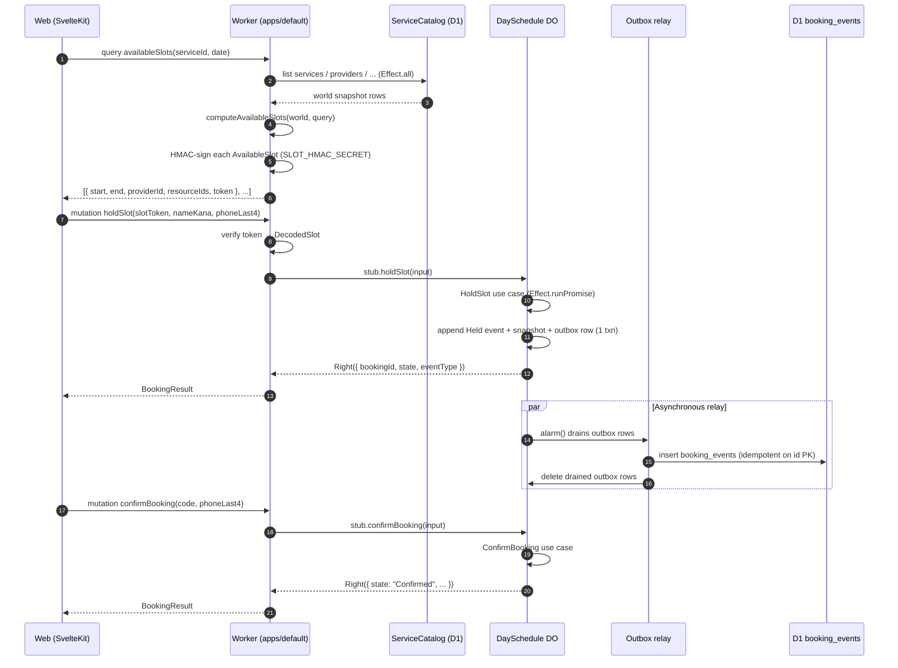

# GraphQL API reference

The booking system speaks one GraphQL endpoint, served by Pothos +
GraphQL Yoga inside `apps/default/src/server/graphql/`. The schema
is the **only** wire surface — no REST, no admin endpoint. This
document is the consumer-facing reference; the resolvers themselves
are the source of truth.

## Endpoint

- Local development: `http://localhost:8787/graphql` (`just dev-default`)
- Production: deployment-specific; the SvelteKit frontend resolves
  via `PUBLIC_GRAPHQL_ENDPOINT` (see `apps/web/src/lib/graphql/endpoint.ts`)

## Query

### `availableSlots(serviceId, date) → [AvailableSlot!]!`

Returns the bookable slots for a service on a single civil date.
Pure result of `computeAvailableSlots(world, query)` — see
ADR-0034 for the matcher's heuristic.

Each slot carries an HMAC-signed `token` (Phase 0.10). The client
**must** echo the token unchanged on `holdSlot` /
`rescheduleBooking`; tampering with `start` / `end` / `providerId` /
`resourceIds` invalidates the signature and the mutation refuses.

### `services / providers / resources / businessHours / closures / providerAbsences`

Read-only catalog listings (Phase 0.8). All entries are exposed
including disabled ones; the staff dashboard filters as needed.

## Mutations — customer

### `holdSlot(date, slotToken, nameKana, phoneLast4, source, freeText) → BookingResult!`

Place a 5-minute hold on the slot identified by `slotToken`. The
DO RPC verifies the token, then runs the `HoldSlot` use case:

1. clock + IdGenerator + repository through Effect Layers,
2. `Booking` aggregate constructed in `Held` state with a fresh
   `BookingCode`,
3. `Held` event appended in the same DO SQL transaction
   (`booking_events.id` PK + `(booking_id, seq)` unique index),
4. outbox row enqueued for D1 relay.

### `confirmBooking(date, code, phoneLast4) → BookingResult!`

Promote a `Held` booking to `Confirmed`. Customer auth =
`BookingCode + PhoneLast4`, lifted to a `CustomerCapability`
inside the use case (ADR-0033). 5-minute TTL on the hold; expiry
is enforced by the DO `alarm()`.

### `cancelBooking(date, code, phoneLast4, reason) → BookingResult!`

Customer-driven cancellation of `Held` or `Confirmed`. The audit
row uses `cancelledBy = "customer"` derived from the capability's
`subjectOf`.

### `rescheduleBooking(date, code, phoneLast4, newSlotToken) → BookingResult!`

Move a `Confirmed` booking to a different slot on the same day.
The new slot is supplied as a fresh HMAC-signed token; the
verification path is identical to `holdSlot`.

## Mutations — staff (capability-gated)

`saveX(input)` / `deleteX(id)` for each catalog entity, twelve
mutations in total. Each requires a `StaffCapability` with the
`manage_catalog` scope. The capability is currently extracted from
an `X-Staff-Capability` request header (base64url-encoded JSON);
Phase 0.11-7 will replace that with Cloudflare Access JWT
verification. The Schema-decode pipeline is identical between the
two mechanisms, only the source differs.

## Errors

Domain refusals surface as the **typed** `BookingError` union arm
(Pothos errors plugin, ADR-0030). Clients distinguish on `__typename`
plus the `tag` field; the `i18nKey` lifts the user-facing message
through `paraglide-js`.

| `tag`                         | `code`                          | severity      | meaning                                         |
| ----------------------------- | ------------------------------- | ------------- | ----------------------------------------------- |
| `InvalidPhoneLast4`           | `E_VAL_PHONE_LAST4`             | validation    | input shape rejected                            |
| `InvalidNameKana`             | `E_VAL_NAME_KANA`               | validation    | input shape rejected                            |
| `InvalidBookingCode`          | `E_VAL_BOOKING_CODE`            | validation    | input shape rejected                            |
| `InvalidSlotToken`            | `E_VAL_INVALID_SLOT_TOKEN`      | validation    | tampered or expired slot envelope               |
| `InvalidCatalogInput`         | `E_VAL_CATALOG_INPUT`           | validation    | catalog mutation payload failed Schema decode   |
| `MissingStaffCapability`      | `E_VAL_MISSING_STAFF_CAPABILITY`| validation    | header absent / malformed / wrong kind          |
| `BookingNotFound`             | `E_DOM_BOOKING_NOT_FOUND`       | domain        | code not in storage                             |
| `PhoneMismatch`               | `E_DOM_PHONE_MISMATCH`          | domain        | code matched but phone last4 differs            |
| `SlotExpired`                 | `E_DOM_SLOT_EXPIRED`            | domain        | hold TTL elapsed before confirmation            |
| `SlotUnavailable`             | `E_DOM_SLOT_UNAVAILABLE`        | domain        | another writer took the slot                    |
| `OutsideBusinessHours`        | `E_DOM_OUTSIDE_HOURS`           | domain        | slot fell off the day's open windows            |
| `ServiceDisabled`             | `E_DOM_SERVICE_DISABLED`        | domain        | service.enabled = false                         |
| `ProviderUnavailable`         | `E_DOM_PROVIDER_UNAVAILABLE`    | domain        | absence or busy                                 |
| `ResourceUnavailable`         | `E_DOM_RESOURCE_UNAVAILABLE`    | domain        | every resource of the requested type is busy    |
| `InvalidStateTransition`      | `E_DOM_INVALID_TRANSITION`      | domain        | command refused at the current state            |
| `InsufficientCapability`      | `E_DOM_INSUFFICIENT_CAPABILITY` | domain        | capability lacked the required scope            |
| `AggregateNotFound`           | `E_INF_AGG_NOT_FOUND`           | infrastructure| aggregate id missing in storage                 |
| `Concurrency`                 | `E_INF_CONCURRENCY`             | infrastructure| OCC clash on save (caller retries)              |
| `Storage`                     | `E_INF_STORAGE`                 | infrastructure| underlying D1 / DO failure                      |

## Customer flow — sequence

## Schema introspection

The schema is generated at runtime from Pothos's `builder.toSchema()`.
A static SDL dump lives at `docs/api/schema.graphql` once Phase 0.12
wires the build target; until then, run
`curl http://localhost:8787/graphql -H 'content-type: application/json'
 -d '{"query":"{ __schema { types { name } } }"}'` for the live shape.
